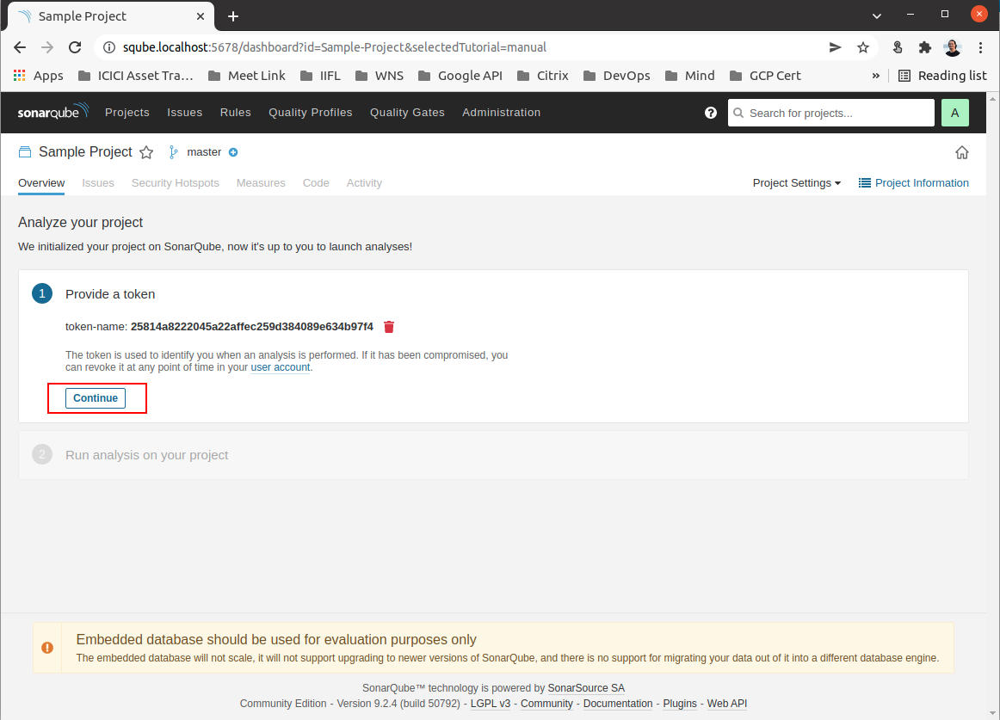

# SonarQube for Local Development

Dockerized SonarQube which can be used across projects for local development. 

There are two parts in Sonar.
* **SonarQube**: A Sonar UI, where you can view the reports and manage projects.
* **SonarScanner**: A cli tool which scans the code and pushes the code quality data to SonarQube.

## SonarQube Installation/Uninstallation
The developers will need to setup a single instance of SonarQube in their PC. After you checkout the code base run the following to start SonarQube.
```
$ bash ./sqdev.sh install
```
This command will install SonarQube in `~/.niveus/` directory and create an executable `sqdev` in `/usr/bin/` which means you can execute sqdev from the terminal in any directory.

<br>

To uninstall SonarQube, but keep all the data, run

```
$ sqdev uninstall
```

To uninstall and remove all data (docker volumes), run

```
$ sqdev uninstall all
```

## Update SonarQube
To update sonarqube-developers with the latest docker-compose files (changes if any), run 

```
$ sqdev update
```
This will pull the latest version of the repository and update sonarqube and sonarscanner docker images to the latest version.

## Start/Stop SonarQube server.
To start SonarQube server, run

```
$ sqdev start
```

To stop SonarQube server, run 
```
$ sqdev stop
```

## Using SonarQube.
Once the SonarQube service is up, you will be able to see the SonarQube UI in [http://localhost:5678](http://localhost:5678).

Now you can start scanning your code for quality. First you will need to create the project in SonarQube.

Follow the screenshots on how to create a project.

### Step 1:


### Step 2:

Note the project key.

### Step 3:


### Step 4:


### Step 5:


### Step 6:


<br>

> NB: Note down the `projectKey` and `login` values. It is required while running Sonar Scanner.

## Running Sonar Scanner
Go to the propject folder and open a terminal in that folder. Then run the following command.

```
$ sqdev scanner -d <path_to_source_code> -k <project_key> -t <token>
```

<br>

### Sonar Scanner args
- `-d | --dir` : Relative/Absolute path to the code directory. If the code is in the project root directory, use `.` (Full Stop character).
- `-k | --key` : SonarQube project key.
- `-t | --token` : SonarQube token.

<br>

Sonar Scanner token (`-t | --token`) is optional if default sqdev token is set up. Refer readme file for more info on how to set it up.

<br>

>NOTE: Make sure SonarQube server is running before running the scanner.

## Setting Default SonarQube Token For sqdev
sqdev supports setting a default SonarQube token so that the user don't have to pass in the token every time they run the scanner.

Once the default token is added, sqdev scanner can be run withoug needing to specify the token.

eg: `sqdev scanner -d . -k <project name>`

To generate a token for sqdev, go to SonarQube dashboard, `my account > security`, enter `sqdev` as the token name and click generate.

Link to the page `http://localhost:5678/account/security/`


Copy the generated token and run `sqdev token <your token>`.


<br>

## Notes
You will need to customize the Quality Gates in your SonarQube UI. 


We will be setting up following criteria in order to pass the code quality checks in staging.

| Metric             | Operator        | Value |
| ------------------ | --------------- | ----- |
| Reliability Rating | is worse than   | B     |
| Security Rating    | is worse than   | B     |
| Vulnerabilities    | is greater than | 0     |

Copy the <mark>DEFAULT</mark> <mark>BUILT-IN</mark> Quality Gates and create a new one. Add above Conditions and make this newly created Quality Gate to the <mark>DEFAULT</mark> one.

